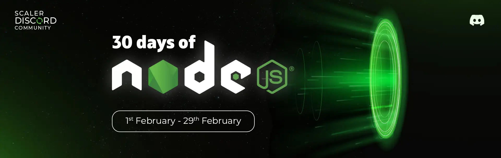
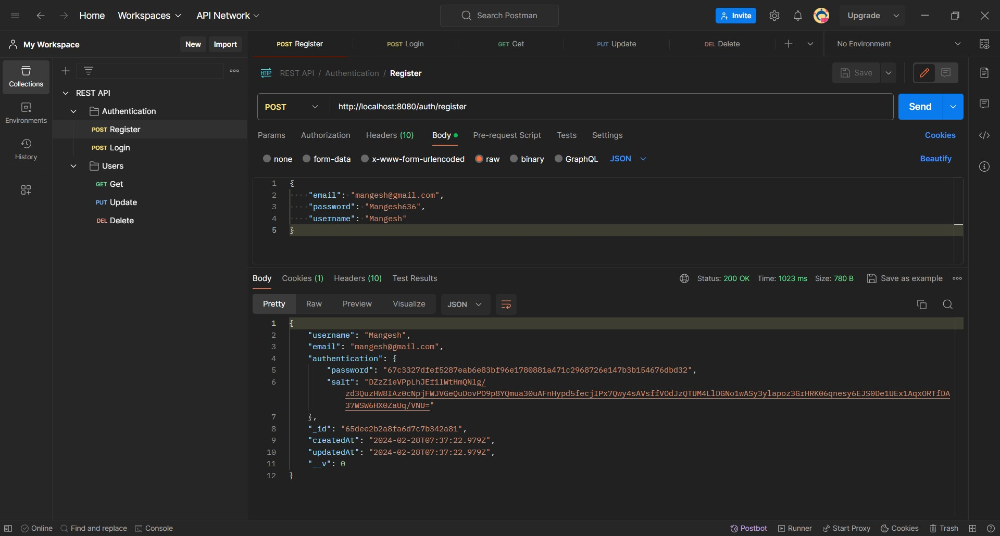
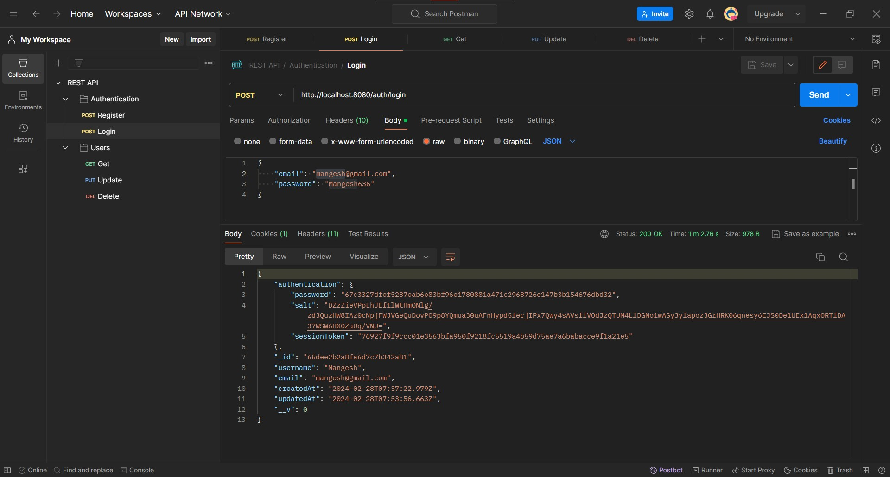
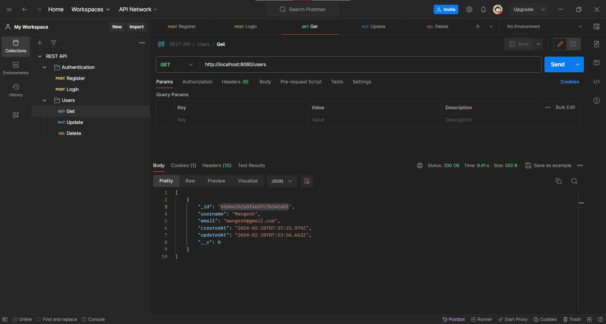
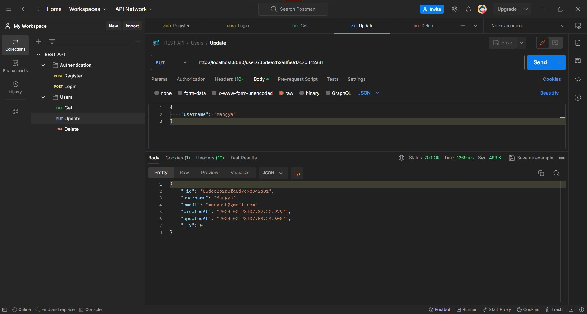
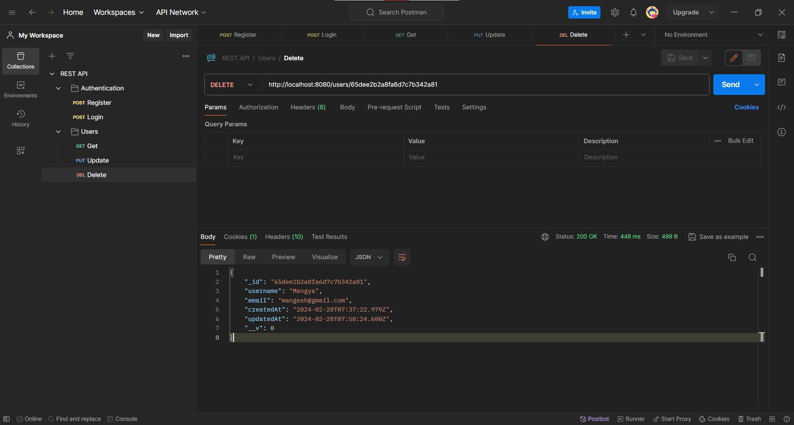

# Simple REST API using Node.Js, Express, TypeScript & MongoDB.



### Scaler Discord Link: [https://discord.com/invite/scaler-by-interviewbit-780066247601291285](https://discord.com/invite/scaler-by-interviewbit-780066247601291285)

This is a repository for **`#nodejs-project-building-challenge`** & part of the **`#30-days-of-nodejs`** challenge.

Features:

- TypeScript, Nodemon Setup,
- MongoDB & mongoose connect, Database creation
- Controllers
- Middlewares
- Cookie based authentication
- Postman testing
- Create, Read, Update, Delete

<iframe width="420" height="315" src="https://www.youtube.com/embed/OBcjDswRt9g?autoplay=1&mute=1&loop=1"></iframe>

## API Documentation: [https://documenter.getpostman.com/view/30334899/2sA2rGtduM](https://documenter.getpostman.com/view/30334899/2sA2rGtduM)

### Prerequisites

**Node Version 20.x**

### Cloning the repository

```shell
git clone https://github.com/Mangesh636/rest__api.git
```

### Install Packages

```shell
npm install
```

### Setup MongoDB URL

In `src/index.ts`:

```ts
const MONGO_URL = "" //MongoDB connection string
```

### Start the app

```shell
npm start
```

## Available Commands

Running commands with npm `npm [command]`

| Command   | Description                             |
| :-------- | :-------------------------------------- |
| `install` | Installs all dependencies               |
| `start`   | Starts a develpment instance of the app |

## Screenshot

- Register
  


- Login
  


- Get
  


- Update
  


- Delete
  
